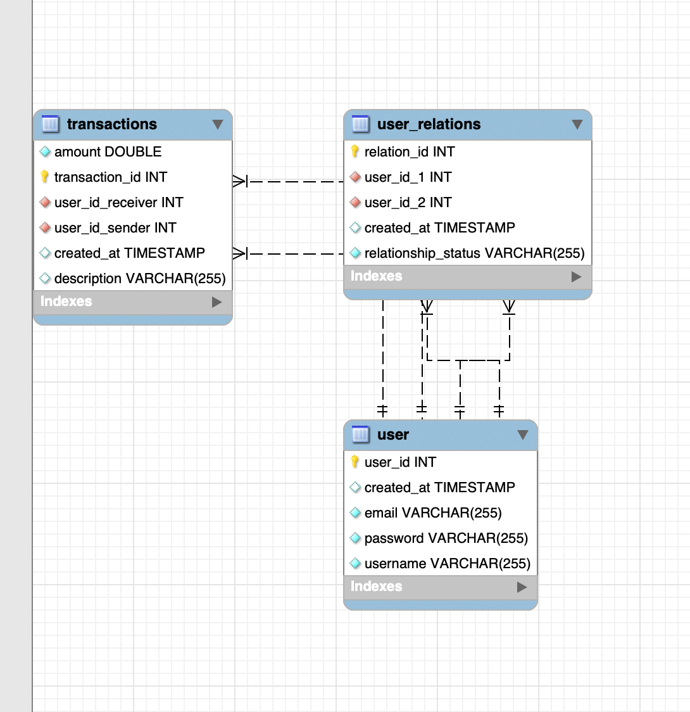

# 💸 PayMyBuddy

Application Java Spring Boot de gestion de transferts d'argent entre amis.  
Elle permet aux utilisateurs de créer un compte, ajouter des relations, et effectuer des virements.

---

## 📸 Aperçu de l'architecture



---

## 🔧 Technologies utilisées

- Java 21
- Spring Boot 
- Spring Security
- Spring Data JPA
- MySQL
- JWT (JSON Web Token)
- Maven
- Thymeleaf 
- JUnit
- JaCoCo (couverture de tests)

---

## 🚀 Installation

### 1. Cloner le projet

```bash
git clone https://github.com/ton-utilisateur/PayMyBuddy.git
cd PayMyBuddy
```

### 2. Créer la base de données MySQL
Avant de lancer l'application, il est nécessaire de créer une base de données sur ton serveur MySQL local.
Exécute la commande suivante pour créer la base de données :
```bash
CREATE DATABASE paymybuddy;
```

### 3. Créer le fichier application.properties

```bash
cp src/main/resources/application.properties.example src/main/resources/application.properties
```

### 4. Installer les dépendances
```bash
mvn clean install
```

### 5. Lancer l'application
```bash
mvn spring-boot:run
```
---

## 📝 Utilisation
Une fois l'application lancée, tu peux créer un compte en accédant à la route suivante dans ton navigateur :

Route principale pour la création de compte :
http://localhost:8080/inscription

### Ajout d'une relation
Pour ajouter une relation, il est nécessaire que la personne à ajouter en tant que relation possède également un compte dans l'application. Ainsi, pour tester la fonctionnalité d'ajout de relations, tu devras créer deux profils utilisateurs distincts. Ces profils permettront de simuler l'ajout de relations entre deux utilisateurs différents.

## 🧪 Tests

```bash
mvn test
```
Un rapport JaCoCo sera généré dans target/site/jacoco/index.html pour la couverture des tests.